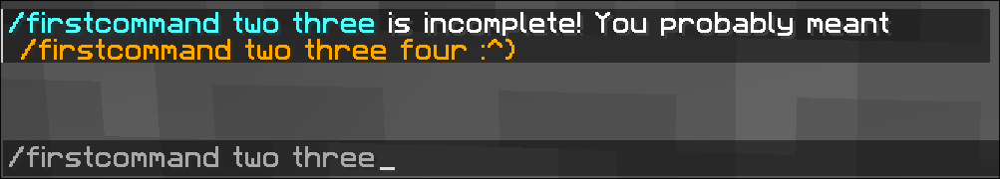

Since **StrokkCommands v1.5**, you can now define executors to be put on command node by default if not explicit
executor is present. This feature is meant to act as a simple way of adding help descriptions or other miscellaneous
'default' behavior.

## The `@DefaultExecutor` annotation
This annotation has the exact same syntax as `@Executor`. It behaves the same way (in fact, you can annotate
the same method both `@Executor` *and* `@DefaultExecutor`) and takes in the same parameter input for a preceding
literal path.

The only difference is that it will also apply itself to all child notes, instead of only the current argument path.

So if you have a structure similar to this:
```java title=MyCommand.java
@Command("command")
class MyCommand {

  @DefaultExecutes
  void help(CommandSender sender, String[] extraArgs) {
    sender.sendPlainMessage("/" + String.join(" ", extraArgs) + " is missing some arguments!");
  }

  @Executes("some literals")
  void logic(CommandSender sender, int num, String word) {
    // ...
  }
}
```
The following paths will be valid for execution:
```
/command                             - MyCommand#help
/command some                        - MyCommand#help
/command some literals               - MyCommand#help
/command some literals <num>         - MyCommand#help
/command some literals <num> <word>  - MyCommand#logic
```

You can optionally add either a `String[]` or `List<String>` parameter to the end of the method parameters
to obtain all arguments (including the command name, without the slash) a user has provided.
This acts as a way to retrieving the command name (and alias) a user has used and for getting any additional
input.

## A practical example: extending `MyFirstCommand`
In [Creating your first command](/docs/commands) we have created a super simple command with a bunch of literals.
The large number of literals might feel very unintuitive to users. For this reason, it makes sense to add a `@DefaultExecutor`
for both the `two three four` sequence and for the general `/firstcommand` command.

Doing this is incredibly easy; we simply need to add two default executors for those cases.
```diff lang=java title=MyFirstCommand.java
 @Command("firstcommand")
 @Aliases("fc")
 @Description("My first StrokkCommands-command!")
 class MyFirstCommand {

+  @DefaultExecutes
+  void help(CommandSender sender, String[] args) {
+    sender.sendRichMessage("""
+            <blue>Command Help for /<cmd></blue><dark_gray>
+             - <gray><aqua>/<cmd> two three four</aqua> a regular fun command >_<</gray>
+             - <gray><aqua>/<cmd> fling</aqua> yeet yourself!</gray>""",
+        Placeholder.parsed("cmd", args[0])
+    );
+  }
+
+  @DefaultExecutes("two")
+  @RequiresOP
+  void helpTwo(CommandSender sender, String[] args) {
+    sender.sendRichMessage("<aqua>/<cmd></aqua> is incomplete! You probably meant <gold>/<cmd_name> two three four<gold> :^)",
+        Placeholder.parsed("cmd", String.join(" ", args)),
+        Placeholder.parsed("cmd_name", args[0])
+    );
+  }

   @Executes("two three four")
   @RequiresOP
   void onExecute(CommandSender sender, @Executor Player player) {
     sender.sendRichMessage("<#f29def>Hey there! You just executed your first command ^-^");
   }

   @Executes("fling")
   @Permission("some.permission")
   void onFling(CommandSender sender, @Executor Player player) {
     player.setVelocity(player.getVelocity().add(new Vector(0, 10, 0)));
     player.sendRichMessage("<b><#c4e6ff>WOOSH</b> <#c4fffd>You've been flung!");
   }
 }
```

### In-game preview
This simple edit behaves exactly how one would expect! Running the command with no arguments will
display the help declared in the `help` method. It will even include the command name exactly how
a user has entered it into the chat bar.


As soon as you enter the `two` literal argument, it will use the `helpTwo` method.


